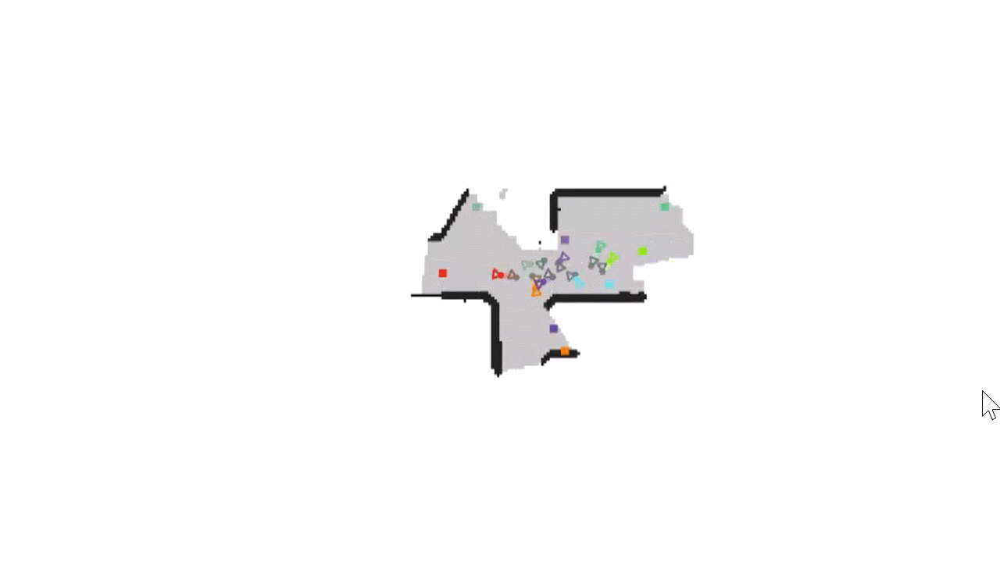
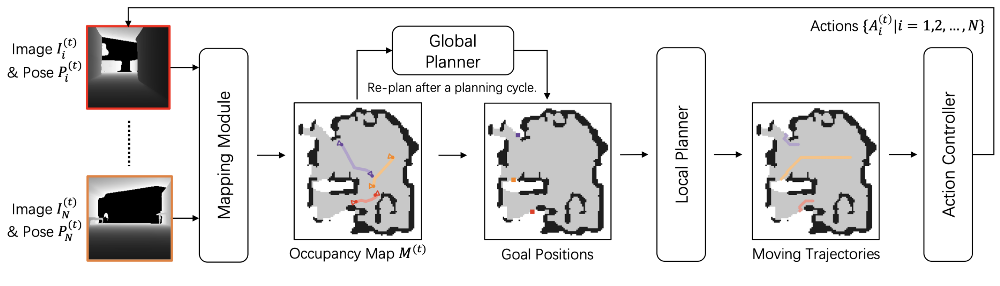
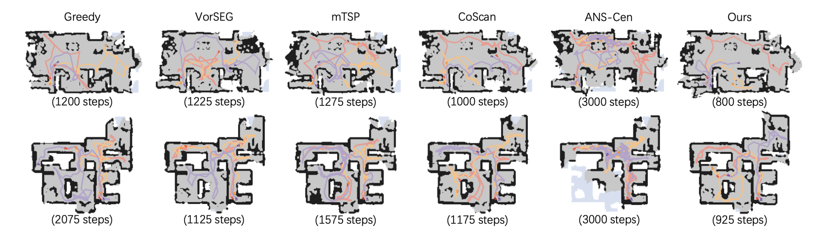

# [CVPR2022] [Multi-Robot Active Mapping via Neural Bipartite Graph Matching](https://arxiv.org/abs/2203.16319)

*Kai Ye, *[Siyan Dong](https://siyandong.github.io/), †[Qingnan Fan](https://fqnchina.github.io/), [He Wang](https://hughw19.github.io/), [Li Yi](https://ericyi.github.io/), [Fei Xia](https://fxia22.github.io/), [Jue Wang](https://juewang725.github.io/), †[Baoquan Chen](http://cfcs.pku.edu.cn/baoquan/)

*Joint first authors | †Corresponding authors | [Video](https://www.youtube.com/watch?v=M7LRzWDG6mk) | [Poster](https://drive.google.com/drive/folders/165IrU8BUIu-fQGhiaV7Sc0zqETs_I6g_?usp=sharing)





We study the problem of multi-robot active mapping, which aims for complete scene map construction in minimum time steps. The key to this problem lies in the goal position estimation to enable more efficient robot movements. Previous approaches either choose the frontier as the goal position via a myopic solution that hinders the time efficiency, or maximize the long-term value via reinforcement learning to directly regress the goal position, but does not guarantee the complete map construction. We propose a novel algorithm, namely NeuralCoMapping, which takes advantage of both approaches. Here is the implementation.






## BUILD

```shell
conda create -p ./venv python=3.6
source activate ./venv
sh ./build.sh && python -m gibson2.utils.assets_utils --download_assets
```


## DATASET

+ Gibson

1. get dataset [here](https://forms.gle/36TW9uVpjrE1Mkf9A)

2. copy URL of `gibson_v2_4+.tar.gz`

3. run command

  ```shell
  python -m gibson2.utils.assets_utils --download_dataset {URL}
  ```


+ Matterport3D

1. get dataset according to [README](https://github.com/StanfordVL/GibsonEnv/blob/master/gibson/data/README.md)

2. run command

  ```shell
  python2 download_mp.py --task_data igibson -o . `
  ```

3. move each folder of scenes to `Gibson Dataset path`

  You can check `Gibson Dataset path` by running

  ```shell
  python -m gibson2.utils.assets_utils --download_assets
  ```


## USAGE

+ Train

```shell
python main.py --global_lr 5e-4 --exp_name 'ma3_history' --critic_lr_coef 5e-2 --train_global 1 --dump_location train --scenes_file scenes/train.scenes
```

+ Test (Example)

```shell
python main.py --exp_name 'eval_coscan_mp3dhq0f' --scenes_file scenes/mp3dhq0-f.scenes --dump_location std --num_episodes 10 --load_global best.global
```

+ Test via scripts

```shell
python eval.py --load best.global --dataset mp3d --method rl -n 5
python eval.py --dataset mp3d --method coscan -n 5
```

+ Analyze performance (compared to CoScan)

```shell
python analyze.py --dir std --dataset gibson -ne 5 --bins 35,70
python analyze.py --dir std --dataset mp3d -ne 5 --bins 100
```

+ Analyze performance (single method)

```shell
python scripts/easy_analyze.py rl --dataset hq --subset abcdef --dir std
```

+ Specify GPU Index

```shell
export CUDA_VISIBLE_DEVICES=3
export GIBSON_DEVICE_ID=4
```

+ Visualization

```shell
python main.py --exp_name 'eval_coscan_mp3dhq0f' --scenes_file scenes/mp3dhq0-f.scenes --dump_location /mnt/disk1/vis --num_episodes 5 --load_global best.global --vis_type 2
# dump at ./video/
python scripts/map2d.py --dir /mnt/disk1/vis vis_hrl -ne 5 -ns 4
```

+ Pretrained model

  [Download](https://drive.google.com/file/d/1F9KH0VZXCiwlVDy9umGjNkLl1adh6htW/view?usp=sharing)


## CITATION

If you find our work helpful in your research, please consider citing:

```
@InProceedings{Ye_2022_CVPR,
    author    = {Ye, Kai and Dong, Siyan and Fan, Qingnan and Wang, He and Yi, Li and Xia, Fei and Wang, Jue and Chen, Baoquan},
    title     = {Multi-Robot Active Mapping via Neural Bipartite Graph Matching},
    booktitle = {Proceedings of the IEEE/CVF Conference on Computer Vision and Pattern Recognition (CVPR)},
    month     = {June},
    year      = {2022},
    pages     = {14839-14848}
}
```


## ACKNOWLEDGMENT

In this repository, we use parts of the implementation from [Active Neural SLAM](https://github.com/devendrachaplot/Neural-SLAM), [SuperGlue](https://github.com/HeatherJiaZG/SuperGlue-pytorch) and [iGibson](https://github.com/StanfordVL/iGibson). We thank the respective authors for open sourcing their code.
